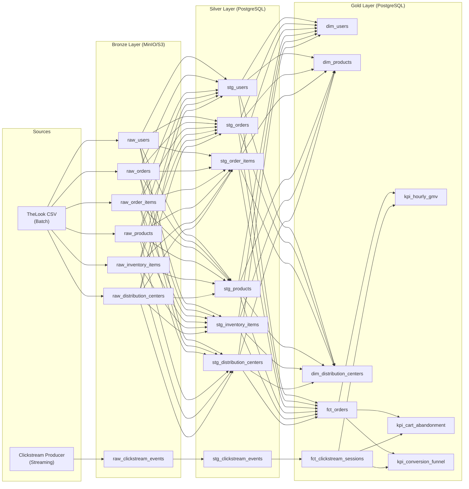

# Data Dictionary & Contracts

> **Version**: 2.0  
> **Last Updated**: 2026-10-06  
> **Purpose**: Single source of truth for all data entities, their schemas, quality rules, and lineage.

---

## 1. Source Systems Overview



---

## 2. Batch Source Schemas (TheLook E-Commerce)

### 2.1 `users`

| Column | Data Type | Nullable | Constraints | Description |
|--------|-----------|----------|-------------|-------------|
| `id` | INTEGER | No | PK | Unique user identifier |
| `first_name` | VARCHAR(100) | No | — | User's first name |
| `last_name` | VARCHAR(100) | No | — | User's last name |
| `email` | VARCHAR(255) | No | UNIQUE, format: `*@*.*` | User email address |
| `age` | INTEGER | No | `>= 12 AND <= 120` | User age at registration |
| `gender` | VARCHAR(10) | No | ENUM: `M`, `F` | Gender |
| `state` | VARCHAR(100) | Yes | — | State/province |
| `street_address` | VARCHAR(255) | Yes | — | Street address |
| `postal_code` | VARCHAR(20) | Yes | — | Postal/ZIP code |
| `city` | VARCHAR(100) | Yes | — | City |
| `country` | VARCHAR(100) | No | — | Country name |
| `latitude` | FLOAT | Yes | `-90 <= x <= 90` | Geo latitude |
| `longitude` | FLOAT | Yes | `-180 <= x <= 180` | Geo longitude |
| `traffic_source` | VARCHAR(50) | No | ENUM: `Search`, `Organic`, `Facebook`, `Email`, `Display` | Acquisition channel |
| `created_at` | TIMESTAMP | No | `>= 2019-01-01` | Registration timestamp |

### 2.2 `orders`

| Column | Data Type | Nullable | Constraints | Description |
|--------|-----------|----------|-------------|-------------|
| `order_id` | INTEGER | No | PK | Unique order identifier |
| `user_id` | INTEGER | No | FK → users.id | Ordering user |
| `status` | VARCHAR(20) | No | ENUM: `Cancelled`, `Complete`, `Processing`, `Returned`, `Shipped` | Order status |
| `gender` | VARCHAR(10) | No | — | User gender (denormalized) |
| `created_at` | TIMESTAMP | No | `>= 2019-01-01` | Order creation time |
| `returned_at` | TIMESTAMP | Yes | `>= created_at` | Return timestamp |
| `shipped_at` | TIMESTAMP | Yes | `>= created_at` | Shipment timestamp |
| `delivered_at` | TIMESTAMP | Yes | `>= shipped_at` | Delivery timestamp |
| `num_of_item` | INTEGER | No | `>= 1` | Number of items in order |

### 2.3 `order_items`

| Column | Data Type | Nullable | Constraints | Description |
|--------|-----------|----------|-------------|-------------|
| `id` | INTEGER | No | PK | Line item identifier |
| `order_id` | INTEGER | No | FK → orders.order_id | Parent order |
| `user_id` | INTEGER | No | FK → users.id | Ordering user |
| `product_id` | INTEGER | No | FK → products.id | Product purchased |
| `inventory_item_id` | INTEGER | No | FK → inventory_items.id | Specific inventory item |
| `status` | VARCHAR(20) | No | ENUM: same as orders | Line item status |
| `created_at` | TIMESTAMP | No | — | Line item creation |
| `shipped_at` | TIMESTAMP | Yes | — | Shipment timestamp |
| `delivered_at` | TIMESTAMP | Yes | — | Delivery timestamp |
| `returned_at` | TIMESTAMP | Yes | — | Return timestamp |
| `sale_price` | FLOAT | No | `> 0` | Actual sale price |

### 2.4 `products`

| Column | Data Type | Nullable | Constraints | Description |
|--------|-----------|----------|-------------|-------------|
| `id` | INTEGER | No | PK | Product identifier |
| `cost` | FLOAT | No | `> 0` | Manufacturing cost |
| `category` | VARCHAR(100) | No | — | Product category |
| `name` | VARCHAR(255) | No | — | Product name |
| `brand` | VARCHAR(100) | No | — | Brand name |
| `retail_price` | FLOAT | No | `> 0` | Retail price |
| `department` | VARCHAR(50) | No | ENUM: `Men`, `Women` | Department |
| `sku` | VARCHAR(50) | No | UNIQUE | Stock keeping unit |
| `distribution_center_id` | INTEGER | No | FK → distribution_centers.id | Source warehouse |

### 2.5 `inventory_items`

| Column | Data Type | Nullable | Constraints | Description |
|--------|-----------|----------|-------------|-------------|
| `id` | INTEGER | No | PK | Inventory item identifier |
| `product_id` | INTEGER | No | FK → products.id | Associated product |
| `created_at` | TIMESTAMP | No | — | When item was stocked |
| `sold_at` | TIMESTAMP | Yes | `>= created_at` | When item was sold |
| `cost` | FLOAT | No | `> 0` | Item cost |
| `product_category` | VARCHAR(100) | No | — | Category (denormalized) |
| `product_name` | VARCHAR(255) | No | — | Name (denormalized) |
| `product_brand` | VARCHAR(100) | No | — | Brand (denormalized) |
| `product_retail_price` | FLOAT | No | `> 0` | Retail price (denormalized) |
| `product_department` | VARCHAR(50) | No | — | Department (denormalized) |
| `product_sku` | VARCHAR(50) | No | — | SKU (denormalized) |
| `product_distribution_center_id` | INTEGER | No | — | DC ID (denormalized) |

### 2.6 `distribution_centers`

| Column | Data Type | Nullable | Constraints | Description |
|--------|-----------|----------|-------------|-------------|
| `id` | INTEGER | No | PK | Distribution center identifier |
| `name` | VARCHAR(255) | No | — | Center name |
| `latitude` | FLOAT | No | `-90 <= x <= 90` | Geo latitude |
| `longitude` | FLOAT | No | `-180 <= x <= 180` | Geo longitude |

---

## 3. Streaming Source Schema (Synthetic Clickstream)

### 3.1 `clickstream_events` (Kafka Topic → Bronze)

| Column | Data Type | Nullable | Constraints | Description |
|--------|-----------|----------|-------------|-------------|
| `event_id` | UUID (STRING) | No | PK, UUID v4 format | Unique event identifier |
| `session_id` | UUID (STRING) | No | UUID v4 format | Browser/app session identifier |
| `user_id` | INTEGER | Yes | FK → users.id (null = anonymous) | Logged-in user, if any |
| `event_type` | VARCHAR(30) | No | ENUM: `page_view`, `add_to_cart`, `remove_from_cart`, `purchase`, `search`, `product_view` | Type of user interaction |
| `page_url` | VARCHAR(500) | No | Starts with `/` | Simulated page path |
| `product_id` | INTEGER | Yes | FK → products.id | Associated product (if applicable) |
| `search_query` | VARCHAR(255) | Yes | Non-empty when event_type = search | Search term |
| `referrer` | VARCHAR(100) | No | ENUM: `direct`, `google`, `facebook`, `instagram`, `email`, `internal` | Traffic source |
| `device_type` | VARCHAR(10) | No | ENUM: `desktop`, `mobile`, `tablet` | Device category |
| `browser` | VARCHAR(50) | No | ENUM: `Chrome`, `Safari`, `Firefox`, `Edge`, `Mobile App` | Browser/client |
| `ip_address` | VARCHAR(45) | No | IPv4 format | Simulated IP address |
| `event_timestamp` | TIMESTAMP | No | Within 24h window (with 5% late arrivals up to 15min) | When event occurred |
| `received_at` | TIMESTAMP | No | `>= event_timestamp` | Kafka ingestion timestamp |

### 3.2 Late-Arriving Event Strategy
- **5% of events** are intentionally delayed by 1–15 minutes (simulating mobile network delays)
- **Watermark**: 10 minutes → events arriving > 10 minutes late are dropped
- **Expected late event drop rate**: < 1% (most late events are within 5 minutes)

---

## 4. Silver Layer Schemas (dbt Staging)

### 4.1 Transformations Applied

| Transformation | Description |
|---------------|-------------|
| Column Renaming | `id` → `user_id`, source-specific naming to business naming |
| Type Casting | Strings → proper types (timestamps, integers, enums) |
| Deduplication | `ROW_NUMBER()` on PK, ordered by `_ingested_at DESC` |
| Null Handling | Default values for non-critical nulls, rejection for critical nulls |
| Technical Columns | `_loaded_at`, `_source_file`, `_is_valid` added |

### 4.2 Data Quality Rules (Great Expectations)

| Rule Category | Example | Severity |
|--------------|---------|----------|
| **Schema** | Column count matches contract | 🔴 CRITICAL (blocks pipeline) |
| **Not Null** | PK columns are never null | 🔴 CRITICAL |
| **Uniqueness** | PK columns have no duplicates | 🔴 CRITICAL |
| **Range** | `sale_price > 0` | 🟡 WARNING (logs + continues) |
| **Referential** | `user_id` exists in users table | 🟡 WARNING |
| **Freshness** | Data not older than 48 hours | 🟡 WARNING |
| **Completeness** | `email` column > 99% non-null | 🟢 INFO |

### 4.3 Dead Letter Queue
- Failed records written to `s3://lakehouse/bronze/_dead_letter/<table>/<date>/`
- Schema: original record + `_rejection_reason` + `_rejected_at`
- Retention: 30 days

---

## 5. Gold Layer Schemas (dbt Marts)

### 5.1 `dim_users`
| Column | Data Type | SCD | Description |
|--------|-----------|-----|-------------|
| `user_key` | SERIAL | — | Surrogate key |
| `user_id` | INTEGER | NK | Natural key from source |
| `full_name` | VARCHAR | — | Concatenated first + last |
| `email` | VARCHAR | — | Email (hashed for privacy) |
| `age_group` | VARCHAR | — | Bucketed: `18-24`, `25-34`, etc. |
| `gender` | VARCHAR | — | `Male`, `Female` |
| `country` | VARCHAR | — | Country name |
| `city` | VARCHAR | — | City |
| `traffic_source` | VARCHAR | — | Acquisition channel |
| `registered_at` | TIMESTAMP | — | Registration date |
| `is_active` | BOOLEAN | — | Has order in last 90 days |

### 5.2 `dim_products`
| Column | Data Type | SCD | Description |
|--------|-----------|-----|-------------|
| `product_key` | SERIAL | — | Surrogate key |
| `product_id` | INTEGER | NK | Natural key |
| `product_name` | VARCHAR | Type 2 | Product name |
| `category` | VARCHAR | Type 2 | Category |
| `brand` | VARCHAR | Type 2 | Brand |
| `department` | VARCHAR | — | Men / Women |
| `retail_price` | FLOAT | Type 2 | Current retail price |
| `cost` | FLOAT | — | Manufacturing cost |
| `margin_pct` | FLOAT | — | `(retail_price - cost) / retail_price` |
| `valid_from` | TIMESTAMP | SCD2 | Row validity start |
| `valid_to` | TIMESTAMP | SCD2 | Row validity end (null = current) |
| `is_current` | BOOLEAN | SCD2 | Current record flag |

### 5.3 `fct_orders`
| Column | Data Type | Description |
|--------|-----------|-------------|
| `order_item_key` | SERIAL | Surrogate key |
| `order_id` | INTEGER | Order identifier |
| `order_item_id` | INTEGER | Line item identifier |
| `user_key` | INTEGER | FK → dim_users |
| `product_key` | INTEGER | FK → dim_products |
| `order_date` | DATE | Order creation date (degenerate dim) |
| `status` | VARCHAR | Order status |
| `sale_price` | FLOAT | Sale amount |
| `cost` | FLOAT | Cost amount |
| `gross_margin` | FLOAT | `sale_price - cost` |
| `is_returned` | BOOLEAN | Whether item was returned |
| `days_to_ship` | INTEGER | `shipped_at - created_at` |
| `days_to_deliver` | INTEGER | `delivered_at - created_at` |

### 5.4 `fct_clickstream_sessions` (Incremental)
| Column | Data Type | Description |
|--------|-----------|-------------|
| `session_key` | VARCHAR | `session_id` (natural key, UUID) |
| `user_key` | INTEGER | FK → dim_users (nullable) |
| `session_start` | TIMESTAMP | First event in session |
| `session_end` | TIMESTAMP | Last event in session |
| `session_duration_seconds` | INTEGER | Duration |
| `page_views` | INTEGER | Count of page_view events |
| `products_viewed` | INTEGER | Count of product_view events |
| `add_to_carts` | INTEGER | Count of add_to_cart events |
| `purchases` | INTEGER | Count of purchase events |
| `searches` | INTEGER | Count of search events |
| `device_type` | VARCHAR | Dominant device type |
| `referrer` | VARCHAR | First-touch referrer |
| `is_bounce` | BOOLEAN | Single page_view, no further action |
| `has_purchase` | BOOLEAN | At least one purchase event |
| `_loaded_at` | TIMESTAMP | dbt incremental load timestamp |

### 5.5 KPI Aggregates

#### `kpi_hourly_gmv`
| Column | Type | Description |
|--------|------|-------------|
| `hour_start` | TIMESTAMP | Truncated hour |
| `total_gmv` | FLOAT | Sum of sale_price |
| `order_count` | INTEGER | Distinct orders |
| `avg_order_value` | FLOAT | GMV / order_count |
| `item_count` | INTEGER | Total items sold |

#### `kpi_cart_abandonment`
| Column | Type | Description |
|--------|------|-------------|
| `date` | DATE | Calendar date |
| `sessions_with_cart` | INTEGER | Sessions with add_to_cart |
| `sessions_with_purchase` | INTEGER | Sessions that converted |
| `abandonment_rate` | FLOAT | 1 - (purchase / cart) |

#### `kpi_conversion_funnel`
| Column | Type | Description |
|--------|------|-------------|
| `date` | DATE | Calendar date |
| `total_sessions` | INTEGER | All sessions |
| `sessions_product_view` | INTEGER | Viewed a product |
| `sessions_add_to_cart` | INTEGER | Added to cart |
| `sessions_purchase` | INTEGER | Completed purchase |
| `view_to_cart_rate` | FLOAT | Funnel step 1→2 |
| `cart_to_purchase_rate` | FLOAT | Funnel step 2→3 |
| `overall_conversion_rate` | FLOAT | Session to purchase |

---

## 6. Data Lineage Summary

```
TheLook CSV → Bronze (MinIO) → GX Validation → Silver (stg_*) → Gold (dim_*, fct_*)
                                                                       ↓
Kafka Producer → Bronze (MinIO) → Spark Streaming → Silver (stg_*) → fct_clickstream_sessions
                                                                       ↓
                                                              KPI Aggregates (kpi_*)
```