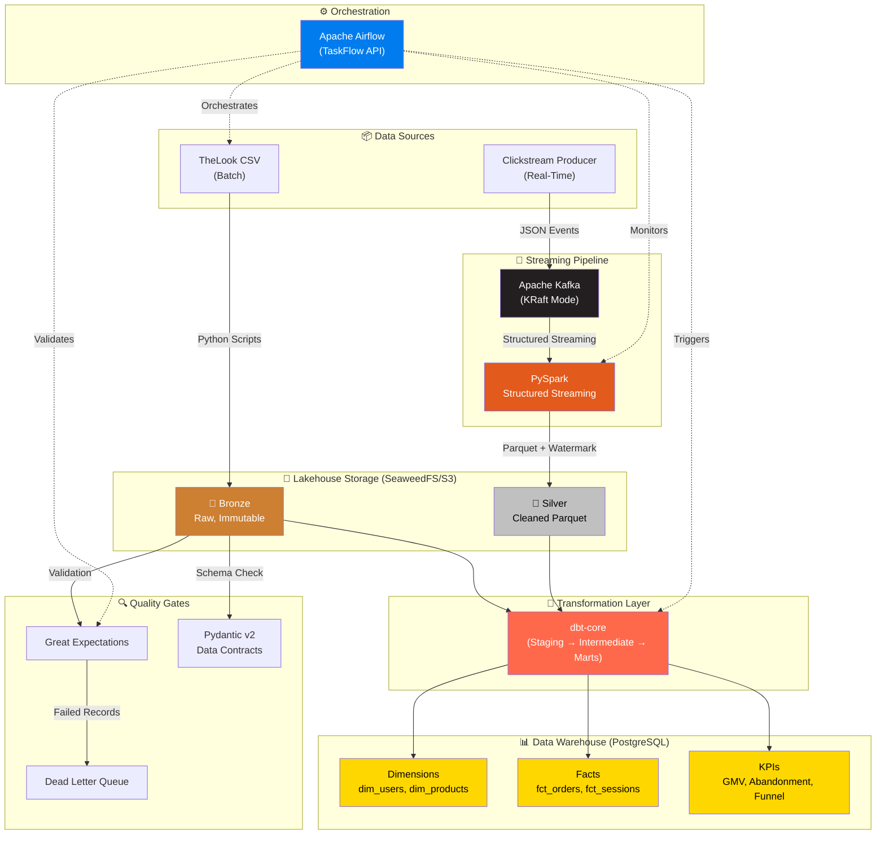

# 🏗️ TheLook E-Commerce Hybrid Lakehouse Platform

> **Production-grade data platform combining batch and real-time streaming pipelines under a unified Medallion Architecture.**

<!-- Badges (activate after CI setup) -->
<!--  -->
<!--  -->
<!--  -->
<!--  -->

---

## 📐 Architecture Overview



---

## 🛠️ Tech Stack

| Layer | Technology | Version |
|-------|-----------|---------|
| **Containerization** | Docker Compose | v2.20+ |
| **Object Storage** | SeaweedFS (S3-compatible) | Latest |
| **Streaming** | Apache Kafka (KRaft) | 3.7 |
| **Stream Processing** | Apache Spark (PySpark) | 3.5+ |
| **Transformation** | dbt-core (dbt-postgres) | 1.7+ |
| **Orchestration** | Apache Airflow | 2.8+ |
| **Data Warehouse** | PostgreSQL | 16 |
| **Data Quality** | Great Expectations + Pydantic v2 | Latest |
| **CI/CD** | GitHub Actions | — |
| **Linting** | Ruff (Python) + SQLFluff (SQL) | Latest |
| **Testing** | pytest + dbt tests | Latest |

---

## 🚀 Quick Start

### Prerequisites
- Docker Desktop (24.0+) with ≥ 8GB RAM allocated
- Git
- Python 3.11+ (for local development)

### 1. Clone & Configure
```bash
git clone https://github.com/<USERNAME>/thelook-lakehouse-platform.git
cd thelook-lakehouse-platform

# Copy environment template
cp .env.example .env
```

### 2. Start All Services
```bash
docker compose up -d

# Wait for all services to be healthy (~2-3 minutes)
docker compose ps
```

### 3. Access UIs
| Service | URL | Credentials |
|---------|-----|-------------|
| **Airflow** | http://localhost:8080 | `airflow` / `airflow` |
| **SeaweedFS Filer UI** | http://localhost:9001 | *(no auth in dev mode)* |
| **Spark Master** | http://localhost:8181 | — |
| **SeaweedFS S3 API** | http://localhost:9000 | `minioadmin` / `minioadmin123` |
| **SeaweedFS Master** | http://localhost:9333 | — |

### 4. Run the Pipeline
```bash
# Option A: Trigger via Airflow UI
# Open http://localhost:8080 → Enable "thelook_batch_pipeline" → Trigger

# Option B: Run components individually
# Batch ingestion
docker compose exec airflow-scheduler python /opt/airflow/src/ingestion/load_to_bronze.py

# Start streaming
docker compose exec airflow-scheduler python /opt/airflow/src/streaming/clickstream_producer.py &
docker compose exec spark-master spark-submit /opt/spark-apps/spark_streaming_job.py

# dbt transformations
docker compose exec airflow-scheduler bash -c "cd /opt/airflow/dbt_project && dbt run && dbt test"
```

### 5. Teardown
```bash
docker compose down -v  # -v removes volumes (clean slate)
```

---

## 📁 Project Structure

```
thelook-lakehouse-platform/
│
├── 📋 PROJECT_CHARTER.md          # Architectural vision & scope
├── 📋 TECH_STACK_RULES.md         # Engineering standards
├── 📋 DATA_DICTIONARY_CONTRACTS.md # Schema definitions
├── 📋 SPRINT_PLAN.md              # Sprint breakdown & timeline
├── 📋 PROGRESS.md                 # Build tracker
├── 📋 README.md                   # This file
│
├── src/
│   ├── ingestion/                 # Batch data loading
│   │   ├── download_thelook.py    # Dataset downloader
│   │   └── load_to_bronze.py      # SeaweedFS/S3 Bronze uploader
│   ├── streaming/                 # Real-time pipeline
│   │   ├── clickstream_producer.py # Kafka event generator
│   │   ├── spark_streaming_job.py  # PySpark Structured Streaming
│   │   ├── spark_config.py         # Spark session builder
│   │   └── schemas.py              # PySpark schemas
│   ├── contracts/                 # Data contracts
│   │   ├── batch_schemas.py       # Pydantic models
│   │   └── validators.py         # Validation orchestrator
│   ├── quality/                   # Data quality
│   │   ├── gx_runner.py           # GX validation runner
│   │   └── expectations/          # GX expectation suites
│   └── utils/                     # Shared utilities
│       ├── s3_client.py           # SeaweedFS/S3 client wrapper
│       └── logging.py            # Structured logging
│
├── dags/                          # Airflow DAGs
│   ├── thelook_batch_pipeline.py  # Main batch DAG
│   ├── streaming_health_check.py  # Streaming monitor
│   └── dbt_transformation.py     # dbt run/test DAG
│
├── dbt_project/                   # dbt transformation layer
│   ├── dbt_project.yml
│   ├── profiles.yml
│   ├── packages.yml
│   ├── models/
│   │   ├── staging/               # 1:1 source mirrors
│   │   ├── intermediate/          # Business logic joins
│   │   └── marts/
│   │       ├── core/              # Kimball star schema
│   │       ├── analytics/         # Streaming-derived models
│   │       └── kpi/               # Pre-aggregated metrics
│   ├── macros/
│   ├── seeds/
│   ├── snapshots/                 # SCD Type 2
│   └── tests/
│
├── docker/                        # Docker configurations
│   ├── airflow/Dockerfile
│   ├── spark/Dockerfile
│   └── kafka/                     # Kafka config overrides
│
├── tests/                         # Python tests
│   ├── unit/                      # Fast, isolated tests
│   ├── integration/               # Docker-dependent tests
│   └── fixtures/                  # Sample data
│
├── scripts/                       # Utility scripts
│   ├── init_minio.sh              # Bucket creation
│   ├── init_kafka.sh              # Topic creation
│   └── init_postgres.sh           # DB initialization
│
├── docs/                          # Extended documentation
│   ├── architecture/              # ADRs, diagrams
│   └── runbooks/                  # Operational guides
│
├── .github/
│   └── workflows/
│       └── ci.yml                 # GitHub Actions CI
│
├── docker-compose.yml
├── pyproject.toml
├── .env.example
├── .gitignore
├── .sqlfluff
└── .pre-commit-config.yaml
```

---

## 🏛️ Medallion Architecture

### Bronze Layer (Raw)
- Immutable, append-only storage on **SeaweedFS** (S3-compatible, drop-in MinIO replacement)
- Technical metadata columns: `_ingested_at`, `_source_file`, `_batch_id`
- Format: Parquet (columnar, compressed)
- Retention: 90 days

### Silver Layer (Cleaned)
- Deduplicated, typed, validated
- Data contracts enforced via Pydantic + Great Expectations
- Failed records routed to dead letter queue
- dbt staging models: `stg_*`

### Gold Layer (Business)
- **Kimball Star Schema**: `dim_users`, `dim_products`, `fct_orders`
- **Streaming Analytics**: `fct_clickstream_sessions` (incremental)
- **KPI Aggregates**: GMV, cart abandonment, conversion funnel
- Materialized in PostgreSQL for BI consumption

---

## 🏗️ Design Decisions

| Decision | Choice | Alternative Considered | Why |
|----------|--------|----------------------|-----|
| Kafka mode | KRaft (no Zookeeper) | Zookeeper ensemble | Simpler ops, fewer containers, future Kafka standard |
| Stream processor | Spark Structured Streaming | Kafka Streams, Flink | Mature API, watermarking, checkpoint, wide adoption |
| DWH target | PostgreSQL | DuckDB, Redshift | Docker-friendly, dbt adapter maturity, SQL standard |
| Incremental strategy | dbt `merge` | `delete+insert`, `append` | Handles late arrivals, upsert semantics, idempotent |
| Data quality | Great Expectations | Soda, dbt tests only | Richer expectation library, HTML reports, GX ecosystem |
| Object storage | **SeaweedFS** | MinIO (archived in 2025/2026) | Active community, S3-compatible, same boto3 API, lighter weight |
| Executor | Airflow LocalExecutor | CeleryExecutor | Sufficient for our DAG count, avoids Redis overhead |

---

## 📚 Documentation

| Document | Description |
|----------|-------------|
| [PROJECT_CHARTER.md](PROJECT_CHARTER.md) | Full architectural vision, scope, and success criteria |
| [TECH_STACK_RULES.md](TECH_STACK_RULES.md) | Coding standards, anti-patterns, version requirements |
| [DATA_DICTIONARY_CONTRACTS.md](DATA_DICTIONARY_CONTRACTS.md) | Complete schema definitions and data quality rules |
| [SPRINT_PLAN.md](SPRINT_PLAN.md) | Sprint breakdown with effort estimates and timelines |
| [PROGRESS.md](PROGRESS.md) | Real-time build progress tracker |

---

## 🧪 Testing

```bash
# Python unit tests
pytest tests/unit/ -v --cov=src --cov-report=term-missing

# dbt tests
cd dbt_project && dbt test

# Linting
ruff check src/ tests/ dags/
sqlfluff lint dbt_project/models/

# All CI checks (locally)
pre-commit run --all-files
```

---

## 📄 License

MIT License — See [LICENSE](LICENSE) for details.

---

## 👤 Author

**Ömer Faruk Doğru**  
Senior Data / Analytics Engineer  
Berlin, Germany  
[LinkedIn](https://linkedin.com/in/omer-faruk-dogru-2020d/)
