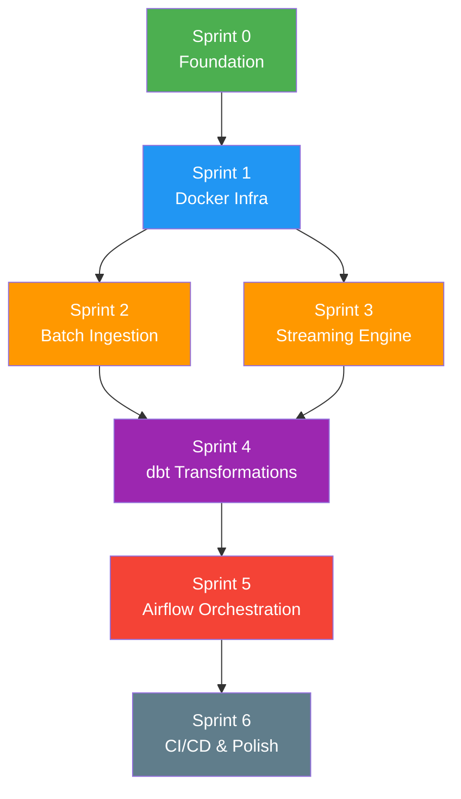

# Sprint Plan & Timeline

> **Version**: 2.0  
> **Last Updated**: 2026-10-06  
> **Methodology**: Modified Agile — 7-day sprints, continuous delivery  
> **Total Estimated Duration**: ~6 weeks (42 days)  
> **Work Mode**: Agentic Coding (Antigravity) + Manual Tasks (marked with 🧑‍💻)

---

## Timeline Overview

```
Week 1          Week 2          Week 3          Week 4          Week 5          Week 6
┌───────────┐   ┌───────────┐   ┌───────────┐   ┌───────────┐   ┌───────────┐   ┌───────────┐
│ Sprint 0  │   │ Sprint 1  │   │ Sprint 2  │   │ Sprint 3  │   │ Sprint 4  │   │Sprint 5+6 │
│ Foundation│   │ Docker    │   │ Batch     │   │ Streaming │   │ dbt       │   │Airflow+CI │
│ & Planning│   │ Infra     │   │ Ingestion │   │ Engine    │   │ Transform │   │& Polish   │
└───────────┘   └───────────┘   └───────────┘   └───────────┘   └───────────┘   └───────────┘
     ▲               ▲               ▲               ▲               ▲               ▲
  YOU ARE           Heaviest        Data             Kafka+          Heaviest        Final
   HERE             DevOps          Contracts        Spark           SQL Work        Polish
```

---

## Sprint 0 — Foundation & Planning
**Duration**: 2–3 days (2026-10-06 → 2026-10-08)  
**Goal**: Solid project scaffold, documentation, and development environment ready.

| # | Task | Effort | Owner | Description |
|---|------|--------|-------|-------------|
| 0.1 | Directory structure | 0.5h | 🤖 Agent | Create all folders: `src/`, `dags/`, `dbt_project/`, `tests/`, `docker/`, `docs/`, `.github/` |
| 0.2 | PROJECT_CHARTER.md | 1h | 🤖 Agent | Full architectural vision, trade-offs, success criteria |
| 0.3 | TECH_STACK_RULES.md | 1h | 🤖 Agent | Coding standards, anti-patterns, version pins |
| 0.4 | DATA_DICTIONARY_CONTRACTS.md | 1h | 🤖 Agent | Complete schemas for all 6 batch + 1 streaming entity |
| 0.5 | SPRINT_PLAN.md | 1h | 🤖 Agent | This document |
| 0.6 | PROGRESS.md | 0.5h | 🤖 Agent | Sprint-based tracker |
| 0.7 | README.md | 1h | 🤖 Agent | Architecture overview, quick start, Mermaid diagrams |
| 0.8 | .gitignore | 0.5h | 🤖 Agent | Comprehensive for Python, Docker, dbt, IDE |
| 0.9 | 🧑‍💻 Git repository setup | 0.5h | 🧑‍💻 **YOU** | `git init`, initial commit, push to GitHub, branch protection |
| 0.10 | 🧑‍💻 Docker Desktop verification | 0.5h | 🧑‍💻 **YOU** | Ensure Docker Desktop is installed, running, and has ≥ 8GB RAM allocated |
| 0.11 | 🧑‍💻 GitHub repo creation | 0.5h | 🧑‍💻 **YOU** | Create GitHub repo, set up remote, configure branch protection rules |

**Sprint 0 Deliverable**: ✅ A professional, fully-documented project skeleton that passes initial review.

### 🧑‍💻 YOUR Manual Tasks for Sprint 0:
```bash
# 1. Initialize git (if not already done)
git init
git add .
git commit -m "feat(project): initial scaffold with documentation v2.0"

# 2. Create GitHub repository
# Go to github.com → New Repository → "thelook-lakehouse-platform"
# Set to PUBLIC (for portfolio visibility)

# 3. Push to GitHub
git remote add origin https://github.com/<YOUR_USERNAME>/thelook-lakehouse-platform.git
git branch -M main
git push -u origin main

# 4. Create develop branch
git checkout -b develop
git push -u origin develop

# 5. Set up branch protection on GitHub:
#    - main: Require PR reviews, require status checks (CI)
#    - develop: Require status checks

# 6. Verify Docker Desktop
docker --version        # Should be 24.0+
docker compose version  # Should be v2.20+
docker info | Select-String "Total Memory"  # Check RAM allocation
```

---

## Sprint 1 — Docker Infrastructure & Local Lakehouse
**Duration**: 5–7 days (2026-10-09 → 2026-10-15)  
**Goal**: All services running with `docker compose up`, health-checked and communicating.

| # | Task | Effort | Owner | Description |
|---|------|--------|-------|-------------|
| 1.1 | `docker-compose.yml` | 3h | 🤖 Agent | PostgreSQL (2 DBs), MinIO, Kafka KRaft, Spark (master + worker), Airflow (webserver + scheduler) |
| 1.2 | `.env.example` | 0.5h | 🤖 Agent | All environment variables with safe defaults |
| 1.3 | `requirements/base.txt` | 0.5h | 🤖 Agent | Core Python deps (pydantic, structlog, boto3, etc.) |
| 1.4 | `requirements/dev.txt` | 0.5h | 🤖 Agent | Dev deps (pytest, ruff, sqlfluff, pre-commit) |
| 1.5 | `requirements/airflow.txt` | 0.5h | 🤖 Agent | Airflow + providers |
| 1.6 | `requirements/spark.txt` | 0.5h | 🤖 Agent | PySpark + Kafka connector |
| 1.7 | `pyproject.toml` | 0.5h | 🤖 Agent | Project metadata, ruff config, pytest config |
| 1.8 | `docker/airflow/Dockerfile` | 1h | 🤖 Agent | Custom Airflow image with Python deps |
| 1.9 | `docker/spark/Dockerfile` | 1h | 🤖 Agent | Custom Spark image with S3A + Kafka JARs |
| 1.10 | `scripts/init_minio.sh` | 0.5h | 🤖 Agent | Create buckets: `lakehouse` (bronze, silver, gold prefixes) |
| 1.11 | `scripts/init_kafka.sh` | 0.5h | 🤖 Agent | Create topic: `clickstream_events` with config |
| 1.12 | `scripts/init_postgres.sh` | 0.5h | 🤖 Agent | Create databases: `airflow_metadata`, `thelook_dwh` |
| 1.13 | Docker health checks | 1h | 🤖 Agent | Health check for each service container |
| 1.14 | Smoke test | 1h | 🤖 Agent | Verify all services are up and can communicate |
| 1.15 | 🧑‍💻 First `docker compose up` | 1h | 🧑‍💻 **YOU** | Run locally, verify all services, troubleshoot resource issues |
| 1.16 | 🧑‍💻 Verify MinIO Console | 0.5h | 🧑‍💻 **YOU** | Open `localhost:9001`, login, verify buckets |
| 1.17 | 🧑‍💻 Verify Airflow UI | 0.5h | 🧑‍💻 **YOU** | Open `localhost:8080`, login, check no import errors |
| 1.18 | 🧑‍💻 Verify Spark UI | 0.5h | 🧑‍💻 **YOU** | Open `localhost:8181`, check worker connected |
| 1.19 | 🧑‍💻 PR: feature/docker-infrastructure | 0.5h | 🧑‍💻 **YOU** | Create PR from `feature/docker-infrastructure` → `develop`, review, merge |

**Sprint 1 Deliverable**: ✅ `docker compose up` → 7 healthy containers, all UIs accessible.

### 🧑‍💻 YOUR Manual Tasks for Sprint 1:
```bash
# 1. Create feature branch
git checkout develop
git checkout -b feature/docker-infrastructure

# 2. After agent completes work, test locally
docker compose up -d
docker compose ps  # All services should show "healthy"

# 3. Access UIs
# MinIO Console:  http://localhost:9001 (minioadmin/minioadmin)
# Airflow:        http://localhost:8080 (airflow/airflow)
# Spark Master:   http://localhost:8181

# 4. Create PR and merge
git add .
git commit -m "feat(infra): docker compose with all services"
git push -u origin feature/docker-infrastructure
# Create PR on GitHub → Review → Merge to develop
```

---

## Sprint 2 — Batch Ingestion & Data Quality
**Duration**: 5–7 days (2026-10-16 → 2026-10-22)  
**Goal**: TheLook data flows from source → Bronze (MinIO) with quality gates.

| # | Task | Effort | Owner | Description |
|---|------|--------|-------|-------------|
| 2.1 | `src/utils/s3_client.py` | 1h | 🤖 Agent | Reusable MinIO/S3 client wrapper (boto3) |
| 2.2 | `src/utils/logging.py` | 0.5h | 🤖 Agent | Structured logging setup with structlog |
| 2.3 | `src/ingestion/download_thelook.py` | 2h | 🤖 Agent | Download TheLook CSV from BigQuery public dataset or GitHub mirror, validate checksums |
| 2.4 | `src/ingestion/load_to_bronze.py` | 2h | 🤖 Agent | Upload CSVs to MinIO Bronze with partitioning by ingestion date, add technical metadata columns |
| 2.5 | `src/contracts/batch_schemas.py` | 2h | 🤖 Agent | Pydantic v2 models for all 6 batch entities with field-level validation |
| 2.6 | `src/contracts/validators.py` | 1h | 🤖 Agent | Validation orchestrator: validate DataFrame against contract, route failures to dead letter |
| 2.7 | `src/quality/expectations/orders_suite.json` | 1h | 🤖 Agent | Great Expectations suite for orders |
| 2.8 | `src/quality/expectations/users_suite.json` | 1h | 🤖 Agent | Great Expectations suite for users |
| 2.9 | `src/quality/gx_runner.py` | 1h | 🤖 Agent | GX validation runner with HTML report output |
| 2.10 | `tests/unit/test_batch_schemas.py` | 1.5h | 🤖 Agent | Pydantic schema tests (valid + invalid + edge cases) |
| 2.11 | `tests/unit/test_load_to_bronze.py` | 1.5h | 🤖 Agent | Mocked S3 upload tests |
| 2.12 | `tests/fixtures/sample_orders.csv` | 0.5h | 🤖 Agent | Sample test data files |
| 2.13 | 🧑‍💻 Run ingestion manually | 1h | 🧑‍💻 **YOU** | Execute scripts, verify data lands in MinIO, inspect Parquet files |
| 2.14 | 🧑‍💻 Review GX validation reports | 0.5h | 🧑‍💻 **YOU** | Open HTML reports, understand pass/fail patterns |
| 2.15 | 🧑‍💻 PR: feature/batch-ingestion | 0.5h | 🧑‍💻 **YOU** | Create PR, review code, merge |

**Sprint 2 Deliverable**: ✅ 6 TheLook tables in MinIO Bronze, validated, with test coverage.

### 🧑‍💻 YOUR Manual Tasks for Sprint 2:
```bash
git checkout develop && git pull
git checkout -b feature/batch-ingestion

# After agent completes:
docker compose exec airflow-scheduler python /opt/airflow/src/ingestion/download_thelook.py
docker compose exec airflow-scheduler python /opt/airflow/src/ingestion/load_to_bronze.py

# Verify in MinIO Console: s3://lakehouse/bronze/orders/... etc.
# Run tests locally:
pytest tests/unit/test_batch_schemas.py -v

# PR workflow
git add . && git commit -m "feat(ingestion): batch pipeline with quality gates"
git push -u origin feature/batch-ingestion
```

---

## Sprint 3 — Streaming Engine (Kafka + PySpark)
**Duration**: 7–10 days (2026-10-23 → 2026-11-01)  
**Goal**: Clickstream events flow from Producer → Kafka → Spark → MinIO Silver in real-time.

| # | Task | Effort | Owner | Description |
|---|------|--------|-------|-------------|
| 3.1 | `src/streaming/clickstream_producer.py` | 3h | 🤖 Agent | Realistic clickstream generator: sessions, user journeys, product interactions, late-arriving events |
| 3.2 | `src/streaming/schemas.py` | 1h | 🤖 Agent | PySpark StructType schema matching Kafka payload |
| 3.3 | `src/streaming/spark_streaming_job.py` | 4h | 🤖 Agent | Full Structured Streaming job: Kafka source → JSON parse → watermark → session windowing → Parquet sink to MinIO |
| 3.4 | `src/streaming/spark_config.py` | 1h | 🤖 Agent | Spark session builder with S3A + Kafka config |
| 3.5 | `tests/unit/test_clickstream_producer.py` | 1.5h | 🤖 Agent | Producer output validation, schema conformance |
| 3.6 | `tests/unit/test_spark_schemas.py` | 1h | 🤖 Agent | Schema parsing tests |
| 3.7 | `tests/integration/test_kafka_roundtrip.py` | 2h | 🤖 Agent | End-to-end: produce → consume → validate (requires Docker) |
| 3.8 | 🧑‍💻 Run producer + streaming job | 1.5h | 🧑‍💻 **YOU** | Start producer, submit Spark job, watch data flow in Spark UI |
| 3.9 | 🧑‍💻 Verify MinIO output | 0.5h | 🧑‍💻 **YOU** | Check Parquet files in `s3://lakehouse/silver/clickstream/` |
| 3.10 | 🧑‍💻 Monitor Spark UI | 0.5h | 🧑‍💻 **YOU** | Observe batches, processing times, watermark progression |
| 3.11 | 🧑‍💻 PR: feature/streaming-engine | 0.5h | 🧑‍💻 **YOU** | Create PR, review, merge |

**Sprint 3 Deliverable**: ✅ Live streaming pipeline: Kafka → Spark → MinIO, with watermarking and checkpointing.

### 🧑‍💻 YOUR Manual Tasks for Sprint 3:
```bash
git checkout develop && git pull
git checkout -b feature/streaming-engine

# After agent completes:
# Terminal 1: Start producer
docker compose exec airflow-scheduler python /opt/airflow/src/streaming/clickstream_producer.py

# Terminal 2: Submit Spark job
docker compose exec spark-master spark-submit \
  --master spark://spark-master:7077 \
  --packages org.apache.spark:spark-sql-kafka-0-10_2.12:3.5.0 \
  /opt/spark-apps/spark_streaming_job.py

# Observe:
# - Spark UI: http://localhost:8181 → Running Applications
# - MinIO Console: s3://lakehouse/silver/clickstream/ → Parquet files appearing

# LEARNING MOMENT 📚: Watch how watermarking works:
# - Late events within 10min window → processed
# - Late events beyond 10min → dropped (check Spark metrics)
```

---

## Sprint 4 — dbt Transformations (Silver & Gold)
**Duration**: 7–10 days (2026-11-02 → 2026-11-11)  
**Goal**: Complete Kimball star schema in Gold layer with incremental models.

| # | Task | Effort | Owner | Description |
|---|------|--------|-------|-------------|
| 4.1 | `dbt_project/dbt_project.yml` | 1h | 🤖 Agent | Project config, vars, model defaults |
| 4.2 | `dbt_project/profiles.yml` (template) | 0.5h | 🤖 Agent | PostgreSQL connection profile |
| 4.3 | `dbt_project/packages.yml` | 0.5h | 🤖 Agent | dbt-utils, dbt-expectations |
| 4.4 | `dbt_project/models/staging/_stg__sources.yml` | 1h | 🤖 Agent | Source definitions + freshness checks |
| 4.5 | Staging models (7 models) | 3h | 🤖 Agent | `stg_users`, `stg_orders`, `stg_order_items`, `stg_products`, `stg_inventory_items`, `stg_distribution_centers`, `stg_clickstream_events` |
| 4.6 | `int_order_items_enriched.sql` | 1h | 🤖 Agent | Join order_items + products + users |
| 4.7 | `dim_users.sql` | 1h | 🤖 Agent | User dimension with age bucketing, activity flag |
| 4.8 | `dim_products.sql` | 1.5h | 🤖 Agent | Product dimension with SCD Type 2 (via dbt snapshot) |
| 4.9 | `dim_distribution_centers.sql` | 0.5h | 🤖 Agent | Simple dimension |
| 4.10 | `fct_orders.sql` | 2h | 🤖 Agent | Order fact with measures: sale_price, cost, margin, delivery days |
| 4.11 | `fct_clickstream_sessions.sql` | 3h | 🤖 Agent | **Incremental**: sessionize Spark output, calculate engagement metrics |
| 4.12 | `kpi_hourly_gmv.sql` | 1h | 🤖 Agent | Hourly GMV aggregate |
| 4.13 | `kpi_cart_abandonment.sql` | 1h | 🤖 Agent | Cart abandonment rate |
| 4.14 | `kpi_conversion_funnel.sql` | 1h | 🤖 Agent | Full conversion funnel metrics |
| 4.15 | YAML contracts for all models | 2h | 🤖 Agent | Column descriptions, types, tests |
| 4.16 | Custom generic tests | 1h | 🤖 Agent | `test_positive_value`, `test_valid_email`, etc. |
| 4.17 | Singular tests | 1h | 🤖 Agent | Business rule assertions |
| 4.18 | `dbt_project/snapshots/snap_products.sql` | 1h | 🤖 Agent | SCD2 for products |
| 4.19 | 🧑‍💻 Run `dbt deps` + `dbt run` + `dbt test` | 1h | 🧑‍💻 **YOU** | Execute full dbt pipeline, review results |
| 4.20 | 🧑‍💻 Run `dbt docs generate` + `dbt docs serve` | 0.5h | 🧑‍💻 **YOU** | Browse auto-generated documentation & lineage graph |
| 4.21 | 🧑‍💻 Query Gold tables in PostgreSQL | 1h | 🧑‍💻 **YOU** | Connect via psql/DBeaver, run analytical queries, validate star schema |
| 4.22 | 🧑‍💻 PR: feature/dbt-transformations | 0.5h | 🧑‍💻 **YOU** | Create PR, review SQL, merge |

**Sprint 4 Deliverable**: ✅ Full Kimball star schema + KPI aggregates + incremental clickstream model.

### 🧑‍💻 YOUR Manual Tasks for Sprint 4:
```bash
git checkout develop && git pull
git checkout -b feature/dbt-transformations

# After agent completes:
cd dbt_project
dbt deps                  # Install packages
dbt seed                  # Load seed data (if any)
dbt run                   # Build all models
dbt test                  # Run all tests
dbt docs generate         # Generate documentation
dbt docs serve            # Open browser → lineage graph!

# LEARNING MOMENT 📚: 
# - Click on models in the lineage graph to see their SQL
# - Run `dbt run --select fct_clickstream_sessions` twice
#   to observe incremental behavior (second run should be faster)
# - Try `dbt run --full-refresh` to see the difference
```

---

## Sprint 5 — Airflow Orchestration
**Duration**: 5–7 days (2026-11-12 → 2026-11-18)  
**Goal**: All pipelines orchestrated, scheduled, and monitored via Airflow.

| # | Task | Effort | Owner | Description |
|---|------|--------|-------|-------------|
| 5.1 | `dags/thelook_batch_pipeline.py` | 3h | 🤖 Agent | Full batch DAG: download → validate → load Bronze → dbt run → dbt test |
| 5.2 | `dags/streaming_health_check.py` | 2h | 🤖 Agent | Periodic check: Kafka topic lag, Spark job status, MinIO output freshness |
| 5.3 | `dags/dbt_transformation.py` | 2h | 🤖 Agent | Standalone dbt DAG: `dbt run --select tag:daily` → `dbt test` |
| 5.4 | `src/utils/airflow_callbacks.py` | 1h | 🤖 Agent | Failure notification callbacks (log-based, extensible to Slack/email) |
| 5.5 | `tests/unit/test_dag_integrity.py` | 1h | 🤖 Agent | DAG import test, no import errors, correct task dependencies |
| 5.6 | 🧑‍💻 Enable DAGs in Airflow UI | 0.5h | 🧑‍💻 **YOU** | Toggle DAGs on, trigger manually, observe task logs |
| 5.7 | 🧑‍💻 Trigger batch pipeline manually | 1h | 🧑‍💻 **YOU** | Watch full pipeline execute, check task logs, verify data in PostgreSQL |
| 5.8 | 🧑‍💻 Simulate a failure | 0.5h | 🧑‍💻 **YOU** | Break something intentionally, observe retry behavior and notifications |
| 5.9 | 🧑‍💻 PR: feature/airflow-orchestration | 0.5h | 🧑‍💻 **YOU** | Create PR, review, merge |

**Sprint 5 Deliverable**: ✅ Production-grade Airflow DAGs with monitoring and retry logic.

### 🧑‍💻 YOUR Manual Tasks for Sprint 5:
```bash
git checkout develop && git pull
git checkout -b feature/airflow-orchestration

# After agent completes:
# 1. Open Airflow UI: http://localhost:8080
# 2. Enable "thelook_batch_pipeline" DAG
# 3. Trigger it manually (play button)
# 4. Click into the DAG run → Graph view → Watch tasks execute
# 5. Click on individual tasks → View Log

# LEARNING MOMENT 📚:
# - Observe the TaskFlow API pattern (how tasks are defined with @task)
# - Check "Gantt" view to see task parallelism
# - Try triggering with a past date to test idempotency
```

---

## Sprint 6 — CI/CD, Testing & Final Polish
**Duration**: 5–7 days (2026-11-19 → 2026-11-25)  
**Goal**: CI/CD pipeline, comprehensive tests, production-ready documentation.

| # | Task | Effort | Owner | Description |
|---|------|--------|-------|-------------|
| 6.1 | `.github/workflows/ci.yml` | 2h | 🤖 Agent | Full CI: ruff, sqlfluff, pytest, dbt compile, pip-audit |
| 6.2 | `.sqlfluff` | 0.5h | 🤖 Agent | SQLFluff configuration for PostgreSQL dialect |
| 6.3 | `.pre-commit-config.yaml` | 0.5h | 🤖 Agent | Pre-commit hooks: ruff, sqlfluff, trailing whitespace |
| 6.4 | `tests/integration/test_end_to_end.py` | 3h | 🤖 Agent | Full pipeline integration test (requires Docker) |
| 6.5 | `docs/architecture/ARCHITECTURE.md` | 2h | 🤖 Agent | Detailed architecture doc with diagrams |
| 6.6 | `docs/architecture/ADR-001-why-kraft.md` | 1h | 🤖 Agent | Architecture Decision Record: Kafka KRaft |
| 6.7 | `docs/architecture/ADR-002-why-structured-streaming.md` | 1h | 🤖 Agent | ADR: Spark Structured Streaming vs Flink |
| 6.8 | `docs/architecture/ADR-003-why-dbt-incremental.md` | 1h | 🤖 Agent | ADR: Incremental strategy |
| 6.9 | `docs/runbooks/RUNBOOK_TROUBLESHOOTING.md` | 1h | 🤖 Agent | Common issues and fixes |
| 6.10 | `docs/runbooks/RUNBOOK_BACKFILL.md` | 1h | 🤖 Agent | How to backfill historical data |
| 6.11 | README.md finalization | 2h | 🤖 Agent | Mermaid diagrams, badges, full quick-start guide |
| 6.12 | 🧑‍💻 Install pre-commit hooks | 0.5h | 🧑‍💻 **YOU** | `pre-commit install`, make a test commit |
| 6.13 | 🧑‍💻 Push to GitHub, verify CI passes | 1h | 🧑‍💻 **YOU** | Watch GitHub Actions run, fix any CI issues |
| 6.14 | 🧑‍💻 End-to-end demo run | 2h | 🧑‍💻 **YOU** | Fresh `docker compose up`, run full pipeline, verify all layers |
| 6.15 | 🧑‍💻 Write personal README section | 1h | 🧑‍💻 **YOU** | Add your personal commentary, lessons learned |
| 6.16 | 🧑‍💻 Final PR: develop → main | 0.5h | 🧑‍💻 **YOU** | Merge develop into main, tag v1.0.0 release |
| 6.17 | 🧑‍💻 LinkedIn/Portfolio post | 1h | 🧑‍💻 **YOU** | Write a technical post about the project |

**Sprint 6 Deliverable**: ✅ CI/CD green, comprehensive docs, portfolio-ready project.

### 🧑‍💻 YOUR Manual Tasks for Sprint 6:
```bash
git checkout develop && git pull
git checkout -b feature/ci-cd-docs

# Install pre-commit
pip install pre-commit
pre-commit install

# After agent completes:
# 1. Make a small change, commit — pre-commit hooks should run
# 2. Push to GitHub — CI should trigger
# 3. Check GitHub Actions tab — all jobs should pass

# Final release:
git checkout main
git merge develop
git tag -a v1.0.0 -m "Release: TheLook Lakehouse Platform v1.0.0"
git push origin main --tags
```

---

## Effort Summary

| Sprint | Agent Effort | Your Effort | Total | Key Risk |
|--------|-------------|-------------|-------|----------|
| Sprint 0 | ~6h | ~1.5h | ~7.5h | None (planning) |
| Sprint 1 | ~10h | ~3h | ~13h | Docker resource limits |
| Sprint 2 | ~12h | ~2h | ~14h | Dataset availability |
| Sprint 3 | ~13h | ~3h | ~16h | Spark/Kafka integration complexity |
| Sprint 4 | ~20h | ~3h | ~23h | Incremental model correctness |
| Sprint 5 | ~9h | ~2.5h | ~11.5h | DAG dependency ordering |
| Sprint 6 | ~15h | ~6h | ~21h | CI environment setup |
| **Total** | **~85h** | **~21h** | **~106h** | — |

---

## 🧑‍💻 Complete List of YOUR Manual Tasks

These tasks **cannot** be performed by the agent and require your direct action:

| Sprint | Task | Why Manual? |
|--------|------|-------------|
| 0 | Git init + push to GitHub | Requires your GitHub credentials |
| 0 | Docker Desktop verification | Local system check |
| 0 | GitHub branch protection setup | Requires repo admin access |
| 1 | First `docker compose up` | Local execution + troubleshooting |
| 1 | Verify UIs (MinIO, Airflow, Spark) | Visual verification |
| 1 | PR creation & merge | Code review workflow |
| 2 | Run ingestion scripts manually | Local execution verification |
| 2 | Review GX reports | Understanding quality reports |
| 2 | PR creation & merge | Code review workflow |
| 3 | Run producer + Spark job | Local execution + observation |
| 3 | Monitor Spark UI | Understanding streaming mechanics |
| 3 | PR creation & merge | Code review workflow |
| 4 | Run dbt pipeline | Understanding dbt lifecycle |
| 4 | Browse dbt docs | Exploring lineage graph |
| 4 | Query Gold tables | SQL verification |
| 4 | PR creation & merge | Code review workflow |
| 5 | Enable & trigger DAGs | Airflow UI interaction |
| 5 | Simulate failure | Understanding retry behavior |
| 5 | PR creation & merge | Code review workflow |
| 6 | Install pre-commit hooks | Local dev setup |
| 6 | Verify CI passes | GitHub Actions monitoring |
| 6 | End-to-end demo run | Full system validation |
| 6 | Write personal README section | Personal voice |
| 6 | Final release (tag v1.0.0) | Release management |
| 6 | LinkedIn/Portfolio post | Career marketing |

---

## Dependencies & Critical Path



> **Critical Path**: Sprint 0 → Sprint 1 → Sprint 3 → Sprint 4 → Sprint 5 → Sprint 6  
> **Parallel Opportunity**: Sprint 2 and Sprint 3 can run in parallel after Sprint 1.
